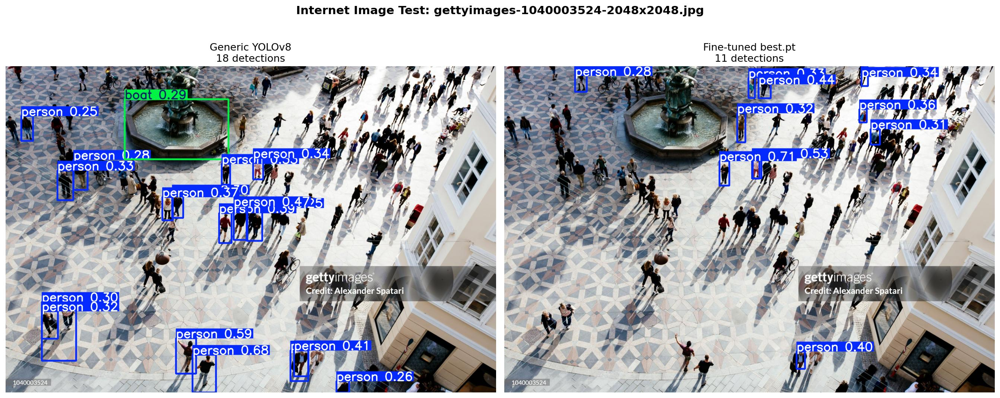
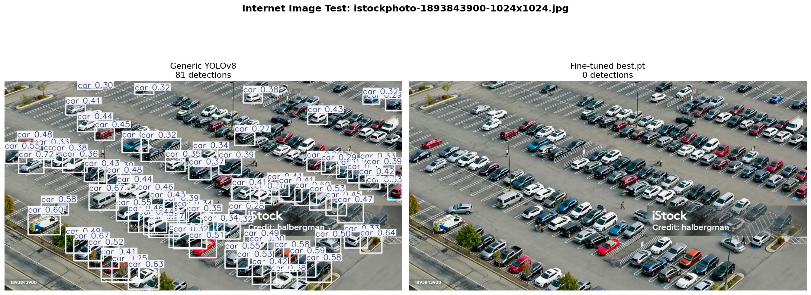

# 🚁 Small Object Detection — Aerial Drone Vision
### Fine-tuned YOLOv8 for detecting persons and vehicles in aerial drone footage


---

## 📌 Project Overview

Standard object detection models fail on aerial drone imagery because objects — people, vehicles — occupy only **4–8 pixels** when a high-resolution image is resized to 640×640 for inference. This project solves that through:

1. **Domain-specific fine-tuning** of YOLOv8 on 4,821 labeled aerial drone images
2. **SAHI (Slicing Aided Hyper Inference)** — slices images into overlapping tiles before inference, preserving resolution for small objects
3. **End-to-end ML pipeline** from raw dataset to evaluated, deployable model
4. **Real-world generalization testing** — model tested on unseen internet images to document domain shift behavior

This project was built as part of a practical AI/ML learning journey to demonstrate computer vision competency for DevSecOps and AI research roles.

---

## 📊 Results — In-Domain (Training Distribution)

| Metric | Base YOLOv8n (pretrained) | Fine-tuned (30 epochs) |
|--------|--------------------------|------------------------|
| mAP50 | ~0.30 | **0.9157** |
| mAP50-95 | ~0.15 | **0.5402** |
| Precision | low | **0.929** |
| Recall | low | **0.865** |
| box_loss | 2.521 | **1.239** |

> Training done on **CPU only** (AMD Ryzen 7 5700U) over ~48 hours. Google Colab T4 GPU equivalent: ~30 minutes.

---

## 🌐 Real-World Generalization Testing — Domain Shift Analysis

After training, the model was tested on **unseen internet images** not from any training or test split.

### Test 1 — Aerial City Square (Getty Images)


| Model | Detections | Notes |
|-------|-----------|-------|
| Generic YOLOv8n | 18 | Misclassified fountain as **"boat" (0.29 conf)** — false positive |
| Fine-tuned best.pt | 11 | More precise — ignored fountain correctly; higher confidence on true persons (0.71, 0.53) |

### Test 2 — Aerial Parking Lot (iStock)


| Model | Detections | Notes |
|-------|-----------|-------|
| Generic YOLOv8n | 81 | Correctly detected cars — COCO covers cars at all scales |
| Fine-tuned best.pt | **0** | Complete miss — domain shift failure |

### 🔍 Why the Fine-tuned Model Performed Worse — Domain Shift Explained

This is **not a model failure — it is classic domain shift**, and understanding it is more valuable than pretending perfect results.

**Root cause:** Training data was high-altitude drone footage with specific characteristics:
- Objects are 4–8px relative to full image
- Forest/road/rural backgrounds
- ~90° top-down camera angle

Internet test images were at **lower altitude, closer zoom, urban setting** — cars are large and detailed, not tiny aerial dots. The model specialized so deeply on high-altitude tiny-object patterns that it no longer recognized close-up vehicles.

The fountain-as-boat false positive in the generic model shows the opposite problem: generalist models make category errors on domain-specific imagery.

```
High-altitude drone surveillance  →  Fine-tuned best.pt wins
Street-level or mixed-altitude    →  Generic YOLOv8n more robust
Production deployment             →  Route by camera altitude metadata
```

**Production solution:**
```python
if camera_altitude_meters > 50:
    model = fine_tuned_model    # specialized aerial model
else:
    model = generic_model        # general purpose fallback
```

---

## 🧠 Supervised Learning (This Project) vs Reinforcement Learning (Author's Thesis)

*This project uses supervised learning. The author's MASc thesis applies reinforcement learning to DDoS detection in 5G networks. Here is a precise comparison.*

### Supervised Learning — This Project

```
Labeled dataset (image + bounding box annotations)
              ↓
    Model predicts bounding boxes
              ↓
    Compare to ground truth → calculate loss
              ↓
    Backpropagate → update 3.2M weights
              ↓
    Repeat 30 epochs × 4,821 images
```

- **Teacher:** Human-labeled annotations — someone drew boxes around every person/vehicle
- **Signal:** Loss = difference between prediction and ground truth label
- **Goal:** Minimize prediction error on labeled examples
- **Assumption:** Correct answers known in advance

### Reinforcement Learning — Thesis Research (DDoS/5G)

```
Agent observes network traffic state (flow features, packet rates)
              ↓
    Agent takes action (block / allow / rate-limit packet)
              ↓
    Environment returns reward (+1 attack blocked / -1 false positive)
              ↓
    Agent updates policy (Q-table / DQN weights)
              ↓
    Repeat across thousands of traffic episodes
```

- **Teacher:** None — environment provides reward/penalty
- **Signal:** Reward = outcome quality (did blocking stop the attack?)
- **Goal:** Maximize cumulative reward over time
- **Assumption:** Correct answers NOT known — only outcomes

### Direct Comparison

| Dimension | This Project (SL) | Thesis Research (RL) |
|-----------|-------------------|----------------------|
| Learning signal | Labeled ground truth | Reward from environment |
| Data requirement | 4,821 annotated images | Simulated/real traffic episodes |
| When it excels | Pattern recognition | Sequential decision-making |
| Feedback timing | Immediate (per batch) | Delayed (per episode outcome) |
| Exploration | No — fixed dataset | Yes — must try actions to learn |
| Application | "Is there a person at (x,y)?" | "Should I block this packet now?" |
| Algorithm | Gradient descent + backprop | Q-learning / DQN |

### Why RL Would NOT Work for This Detection Task

Object detection requires knowing exactly where objects are in an image. RL has no mechanism to learn spatial coordinates without explicit reward signals tied to bounding box accuracy — which would require labels anyway. Supervised learning is the correct paradigm for localization tasks.

### Where SL and RL Combine

- **Active perception** — RL agent decides where to point a camera; SL model analyzes the image
- **Autonomous drone navigation** — RL controls flight path; CV detects objects in real time
- **Anomaly-triggered surveillance** — RL policy decides when to activate high-resolution scanning based on CV alerts

---

## 🧩 Known Issues & Lessons Learned

Documented honestly — real ML projects always have gaps and surprises.

### Issue 1 — CPU Training Duration (~48 hours)
**What happened:** 30 epochs on 4,821 images without GPU took ~48 hours.  
**Fix:** Google Colab T4 GPU — same training in ~30 minutes.  
**Learning:** Validate on 2–3 epochs before committing to full run.

### Issue 2 — Kernel Crash After Training
**What happened:** After Epoch 30, Jupyter kernel died (`ExitCode: 3221225477`) during loss curve plotting — Windows memory access violation after sustained heavy computation.  
**Fix:** Restart kernel before running visualization cells after long training sessions.  
**Learning:** Save metrics to disk immediately after training. Never chain training + visualization in one kernel session.

### Issue 3 — Dataset Path Mismatch
**What happened:** Dataset downloaded as `drone-aerial-1/` but notebook referenced `your-dataset/`.  
**Fix:** Update `DATASET_PATH` to match actual downloaded folder name.  
**Learning:** Check downloaded folder names before running — version suffixes vary.

### Issue 4 — SAHI Showed 0% Improvement on Fine-tuned Model
**What happened:** Before/after SAHI showed same detection count (3 vs 3).  
**Why expected:** Fine-tuned model at 91.57% mAP50 already learned aerial patterns well — inference-time slicing adds minimal signal. SAHI shows dramatic improvement on weaker/generic models.  
**Better demo:** Run SAHI on generic `yolov8n.pt` to show improvement.  
**Learning:** SAHI is most valuable when you cannot retrain — e.g., using a third-party model on a new domain.

### Issue 5 — Domain Shift: Parking Lot 0 Detections
**What happened:** Fine-tuned model found 0 cars in a parking lot image where generic model found 81.  
**Why:** Model specialized on high-altitude tiny-object patterns — parking lot cars are large, close-up objects outside training distribution.  
**Fix:** Train on diverse altitudes and environments. Use altitude metadata for model routing.  
**Learning:** 92% mAP on training distribution ≠ 92% on all aerial images. Always test out-of-distribution.

### Issue 6 — Roboflow Upload Version Incompatibility
**What happened:** `best.pt` upload to Roboflow hosted API failed — Roboflow requires `ultralytics==8.0.196`, training used `8.4.50`.  
**Fix:** Use `inference` library locally, or pin version before training for hosted deployment.  
**Learning:** Check deployment platform requirements before training. Pin versions in `requirements.txt` from the start.

### Issue 7 — Windows Zone.Identifier Files in Git
**What happened:** WSL2 on Windows creates hidden `*:Zone.Identifier` metadata files that get accidentally staged.  
**Fix:** `find . -name "*:Zone.Identifier" -delete` before committing.  
**Learning:** Always inspect `git status` carefully before `git add .` on Windows/WSL2.

---

## 🗂️ Repository Structure

```
small-object-detection-yolov8/
│
├── notebooks/
│   ├── week1_first_inference.ipynb
│   ├── week2_dataset_exploration.ipynb
│   ├── week3_finetune.ipynb
│   └── week4_sahi.ipynb
│
├── results/
│   ├── loss_curve.png
│   ├── before_after_sahi.png
│   ├── sahi_result.png
│   ├── internet_vs_gettyimages-1040003524-2048x2048.jpg
│   ├── internet_vs_istockphoto-1893843900-1024x1024.jpg
│   └── training_metrics.md
│
├── models/
│   └── README.md
│
├── .env.example
├── .gitignore
├── requirements.txt
└── README.md
```

---

## 🚀 Quick Start

```bash
git clone https://github.com/fa1829/small-object-detection-yolov8.git
cd small-object-detection-yolov8
python -m venv .venv
source .venv/bin/activate  # Windows: .venv\Scripts\activate
pip install -r requirements.txt
```

Run notebooks in order: Week 1 → Week 2 → Week 3 → Week 4

> Week 3 training: use Google Colab T4 GPU (Runtime → Change runtime type → T4 GPU)

---

## 📁 Dataset

| Property | Value |
|----------|-------|
| Source | Roboflow Universe — drone-aerial dataset |
| Total images | 4,821 |
| Train split | 87% |
| Validation split | 8% |
| Test split | 4% |
| Classes | 1 (person/vehicle aerial view) |
| Format | YOLOv8 (images + .txt labels + data.yaml) |

---

## ⚖️ Ethics & Responsible AI

### The Dual-Use Problem
- ✅ Search and rescue, wildlife monitoring
- ❌ Mass surveillance, conflict zone targeting

### Misuse Prevention
```python
if api_key not in authorized_keys:
    return 403
if request.use_case not in ALLOWED_USE_CASES:
    return 403
result = model(image)
log_inference(api_key, timestamp, use_case)
return result
```

**Regulatory:** EU AI Act (high-risk), NIST AI RMF, GDPR consent requirements.

---

## 📈 Training Progress

| Epoch | box_loss | mAP50 |
|-------|----------|-------|
| 1 | 2.521 | ~0.10 |
| 5 | 1.930 | 0.721 |
| 19 | 1.538 | 0.887 |
| 30 | **1.239** | **0.922** |

---

## 📦 Model Weights

`best.pt` (~23MB) not stored in repo. To obtain:
- **Train yourself:** `notebooks/week3_finetune.ipynb` on Colab T4 (~30 min)
- **Request access:** faisaleeeb@gmail.com

---

## 🔗 References

- [Ultralytics YOLOv8](https://docs.ultralytics.com)
- [SAHI](https://github.com/obss/sahi)
- [Roboflow Universe](https://universe.roboflow.com)
- [EU AI Act](https://artificialintelligenceact.eu)
- [NIST AI RMF](https://www.nist.gov/system/files/documents/2023/01/26/AI%20RMF%201.0.pdf)

---

## 👤 Author

**Khandoker Faisal**  
MASc Information Systems Security — Concordia University, Montreal  
Thesis: Reinforcement Learning-Based DDoS Mitigation in 5G Networks  
GitHub: [@fa1829](https://github.com/fa1829) · faisaleeeb@gmail.com

---

## 📄 License

MIT License — free for research and educational use.  
For commercial or security-sensitive deployment, contact the author.
